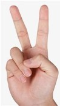
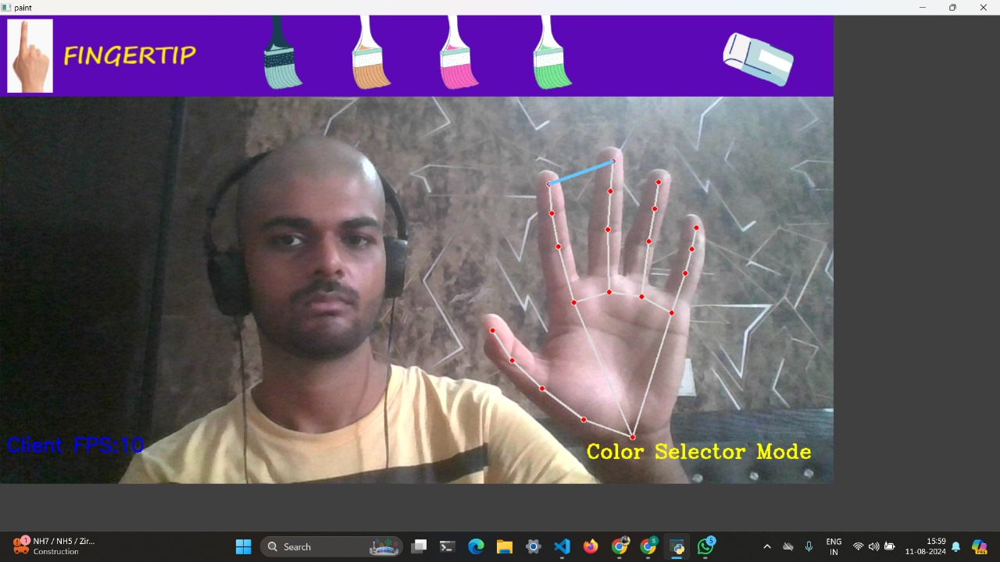
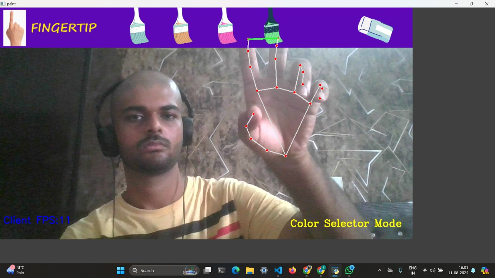
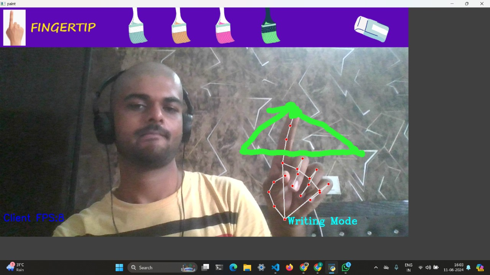

# TouchPro

A hands-free virtual painting/illustration tool

2 _handy_ modes of operation :

- ### Selection mode with both index and middle fingers up

  

                                                              |
                                                              |
                                                              V

  

&nbsp;

- ### Drawing/Writing mode with index finger up

  

&nbsp;

## How it works :-

1.  Make a handtracking module using mediapipe
    containing class: handDetectopr
    containing methods:-

        ` i> findHands`

        `ii> findPosition`

        `iii> fingersUp`

        `iv> findDistance`

2.  Now working on the main file:-

    `i> load header files from folder`

    `ii> capture video using webcam (cv2.videoCapture(0))`

    `iii> initialize : detector = htm.handDetector(detectionCon=0.75, maxHands=1)`

    **_(where htm = an instance of the HandTrackingModule)_**

    [Note: we don't increase the threshold for detectionCon too much or else it will be difficult for our hands to get tracked]

    `iv> run an infinite while loop : (remains throughout the painting session)`

    `v> Import image from video using cap.read()` **_(where cap = cv2.VideoCapture(0))_**

    `vi> Flip the image horizontally : img = cv2.flip(img, 1)`

    - **reason** - to counterpoise the effect of lateral inversion of image captured by webcam.

    `vii> find hands in frame and then hand landmarks :`

    ```
    img = detector.findHands(img)
    lmList = detector.findPosition(img, draw=False)
    ```

    **_(where lmlist -> list of landmarks' co-ordinates detected on hand, realtime credits to "mediapipe")_**

    `viii> note (x,y) for TouchPro of index and middle fingers`

    ```
    x1, y1 = lmList[8][1:]   # index fingertip = 8th landmark point
    x2, y2 = lmList[12][1:]
    ```

    `ix> check which fingers are up : fingers = detector.fingersUp()`

    **[ fingersUp() -> a custom function (user-made), which returns a boolean list for all 5 fingertips as:
    True -> if that finger is up, else False ]**

    `x> If index and middle fingers are up -> selection mode :`

    draw a rectangle from index finger tip to middle finger tip (width)
    and height = difference between ordinates of the two tips.

    ```
    cv2.rectangle(img, (x1, y1 - 25), (x2, y2 + 25), drawColor, cv2.FILLED)
    ```

    decide drawColor based on which option (pixel-co-ord range) is the fingertip falling

    `xi> only index finger up -> drawing mode : select drawColor of the selected option.`

    **[ For eraser, circle radius is kept bigger and color is (0, 0, 0) (Black) ]**

    - **Reason why that works** : drawing black over any color means doing AND operation of any pixel value with 0 which gives 0 (0 and X = 0 in boolean logic). So, the effect of that color is removed.

## PROBLEMS Encountered :

### Problem 1 :

Screen gets overlayed with new frames (for 30 fps, it happens every 1/30th of a second)
So no drawing can be seen on videocapture.
Solution : draw on a seperate canvas (a python window)
and then intelligently overlay it on top of the videoCapture window :

#### How was it resolved :

The main idea is to draw on a seperate window(say imgCanvas) and mask it over
videoCapture image (say img)

**a>** if we try overlaying the 2 windows with
50% transperancy each, it looks pale and bad
so, try plan B :-

**b>** -> Convert imgCanvas from BGR to Gray
imgGray = cv2.cvtColor(imgCanvas, cv2.COLOR_BGR2GRAY)

So what will happen is - after this step, the background will remain
same i.e. black, but all other colors will get white.

- Next -> Invert it to get an inverted image

```
_, imgInv = cv2.threshold(imgGray, 50, 255, cv2.THRESH_BINARY_INV)
```

So what will happen is - after this step, the background will get white
and the drawing will get black. This will be our mask image.

- Next -> before we try to put our mask i.e. "imgInv" on "img', we
  need to convert it back to BGR as colored images can't be operated with Grayscaled imgaes.

```
imgInv = cv2.cvtColor(imgInv,cv2.COLOR_GRAY2BGR)
```

- Next -> This is the most interesting part in the whole project :-

```
img = cv2.bitwise_and(img,imgInv)
```

After this step, we will see the drawing in the videoCapture window
BUT IN BLACK -> reason -> our mask was a binary mask
i.e. pixels were either 0(black) or 255(white) (although converted to BGR i.e. 3 channels
but all channels either 0 or 255)

Now doing bitwise **AND** of black(0) (on invIng) with any other color(>0) (on img)
will give 0 i.e. black -> so our drawing will appear on img.
but rest all parts were white so bitwise AND of 255 with any color is that color,
so no change observed for the remaining portions of the videoCapture image.

But, this is not what we wanted, we want to see the colored drawing , not a black drawing.
So, apply the colors of the Canvas window by doing bitwise **OR** :-

```
img = cv2.bitwise_or(img,imgCanvas)
```

#### Why does this solve the problem? : bitwise OR of pink(say) and black(0) will give the

higher value i.e. pink.
and for the background : it was black background in Canvas but non-black background in
videoCapture frame. So, bitwise OR will keep the background of the videoCapture frame,
which is just what we want.

### Problem 2:

in drawing mode, everytime the painting began from 0,0 co-ordinate i.e. top-left corner
which gave auckward looking lines.
**reason** : x_prev and y_prev were initialized as (0,0) and line was drawn
from (x_prev, y_prev) to (x_current, y_current)
solution : add this code :

```
if(x_prev, y_prev=0,0): # i.e. the first move
	x_prev, y_prev = x_current, y_current
```

#### Sub-problem :

Now, drawing doesn't begin from top-left corner of screen but from the
end of the last drawn line which too is weird.

To fix it: apply the above fix at the start of every selection :

```
x_prev, y_prev = x_current, y_current
```
